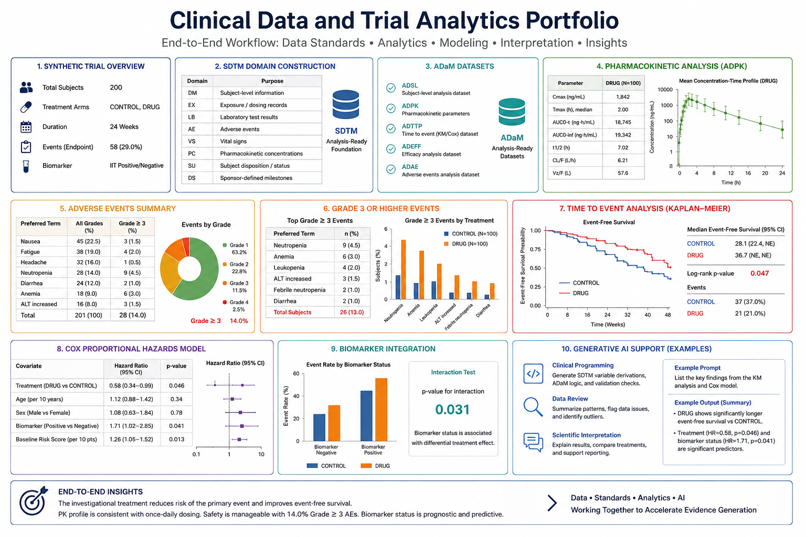

# Clinical Development AI and Trial Analytics

An end-to-end, reproducible portfolio demonstrating clinical trial simulation, clinical data standards, analysis-ready dataset derivation, pharmacokinetics, safety analysis, survival modelling, biomarker integration, and governed generative-AI support.



## Scope

The project demonstrates:

- synthetic patient-level randomised clinical trial generation;
- SDTM-style `DM`, `EX`, `AE`, `LB`, `PC`, and `DS` domains;
- ADaM-style `ADSL`, `ADTTE`, and `ADRESP` datasets;
- noncompartmental PK parameters, including `AUC0-24`, `AUCinf`, `Cmax`, `Tmax`, terminal elimination rate, and half-life;
- treatment-emergent adverse-event summaries and Grade 3 or higher reporting;
- Kaplan-Meier estimation and Cox proportional-hazards modelling;
- objective-response analysis, biomarker stratification, interaction assessment, and predictive-model calibration;
- aggregate, de-identified generative-AI prompt construction with deterministic review safeguards;
- reproducibility checks, traceability, and export of analysis datasets.

All patient records and results are simulated. The repository is intended for education, technical demonstration, and portfolio review. It is not suitable for regulatory submission or clinical decision-making.

## Repository structure

```text
clinical-development-ai-trial-analytics/
├── notebooks/
│   ├── clinical_data_trial_analytics.ipynb
│   └── clinical_data_trial_analytics_executed.ipynb
├── manuscript/
│   └── Integrated_Clinical_Data_Trial_Analytics_Manuscript.docx
├── figures/
│   └── clinical_data_trial_analytics_workflow.png
├── requirements.txt
├── CITATION.cff
├── LICENSE
└── README.md
```

## Installation

```bash
git clone https://github.com/mpetalcorin/clinical-development-ai-trial-analytics.git
cd clinical-development-ai-trial-analytics
python -m venv .venv
source .venv/bin/activate
python -m pip install --upgrade pip
pip install -r requirements.txt
jupyter lab notebooks/clinical_data_trial_analytics.ipynb
```

On Windows PowerShell, activate the environment using:

```powershell
.venv\Scripts\Activate.ps1
```

## Analytical workflow

1. Simulate baseline characteristics, treatment assignment, biomarkers, efficacy outcomes, survival, censoring, exposure, laboratory measurements, pharmacokinetic concentrations, and adverse events.
2. Transform source records into SDTM-style domains.
3. Derive subject-level and endpoint-level ADaM-style analysis datasets.
4. Validate uniqueness, populations, treatment traceability, event variables, and analysis flags.
5. Estimate PK exposure and disposition parameters.
6. Summarise adverse events using subject-level incidence denominators.
7. Estimate survival functions and fit adjusted Cox models.
8. Evaluate objective response and treatment-by-biomarker heterogeneity.
9. Build cross-validated endpoint predictions and assess calibration.
10. Generate de-identified aggregate summaries for governed AI-assisted review.

## Key governance principles

Generative AI is treated as an assistive layer rather than an authoritative analytical engine. Patient-level data are not transmitted externally. Generated interpretations require deterministic verification, model-version control, audit logging, protected-data filtering, and qualified human review.

## Outputs

Running the notebook creates `clinical_trial_analytics_outputs/`, containing simulated SDTM-style domains, ADaM-style analysis datasets, PK parameters, safety summaries, a study scorecard, and an aggregate AI-review JSON file.

## Author

**Mark Ihrwell R. Petalcorin, PhD**  
Molecular biology, biochemistry, translational oncology, clinical data science, machine learning, and biomedical AI.

## License

Released under the MIT License. See [LICENSE](LICENSE).

## Publish this prepared repository to GitHub

The included helper script creates the public repository under `mpetalcorin` and pushes the committed `main` branch using GitHub CLI:

```bash
./publish_to_github.sh
```

The script checks GitHub authentication, creates the repository when absent, or pushes to the existing repository when already created.
